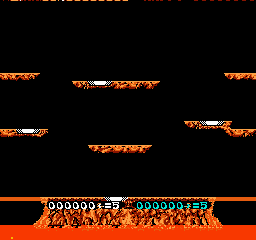

# jev-joust

Two [TypeSafe Jev](https://typesafe.ai) players, one per controller, duelling in NES Joust for score.
Requires `rom/joust.nes`.

Every decision, code runs the emulator forward over each controller state a player could hold and writes down
what actually happens. Jev reads those outcomes and picks one. Code does the arithmetic and the physics; Jev
does the judging.



Two Jev players duelling to game over: wave 3, 4750 and 7500 points. Kills are the 500s, eggs the 250s.

## Results

Every game below is played to game over, not to a frame limit, because that is the objective Joust actually
sets and the one the [StrategyWiki walkthrough](https://strategywiki.org/wiki/Joust/Walkthrough) optimises
for. `greedy` ranks the same simulated options by a fixed rule, so a match against it compares the judgment
and nothing else.

| player 1 | player 2 | frames | wave reached | score | total |
|---|---|---|---|---|---|
| jev | jev | 4440 | 3 | 4750 / 7500 | 12250 |
| greedy | greedy | 14460 | 9 | 23250 / 26750 | 50000 |
| jev | jev | 2868 | 2 | 2000 / 4000 | 6000 |
| jev | greedy | 5664 | 4 | 11250 / 10250 | 21500 |
| greedy | jev | 4992 | 3 | 4000 / 7500 | 11500 |

Head to head over both seats, 10656 frames: **Jev 18750 points (1760 per 1000 frames) against greedy's
14250 (1337)**. Jev outscores the fixed rule by 32% and does so in both seats.

Do not read the mirror games as a ranking. Two Jev players attack each other and the game ends by wave 3;
two `greedy` players leave each other alone and coexist to wave 9. That measures how much a pair fights, not
how well either plays. `greedy` is also fully deterministic, so its mirror game repeats byte for byte and is
one sample however many times it is run.

On 80 recorded decisions where the options are worth different amounts, scored against what the game says
turns out best: Jev picks an optimal option 0.94–0.96 of the time over four runs, against 0.90 for the fixed
rule, 0.725 for always playing the best single option and 0.567 for picking at random. That metric is close
to its ceiling for both, because 3.4 of the 6 options are optimal in the average state, so it separates them
weakly and should not be read as the last word.

Median Jev latency 0.18 s, about 1000 input tokens per call, one call per player per decision.

## Run

```bash
cp .env.example .env        # TYPESAFE_API_KEY
uv sync
uv run python joust.py --play --p1 jev --p2 greedy      # a match; bots below
uv run python joust.py --record 80                      # write labelled decisions to data/states.jsonl
uv run python joust.py --offline                        # score Jev on them; no emulator, no match
uv run --group dev pytest
```

| bot | decides by |
|---|---|
| `jev` | one Choice over the six simulated options |
| `greedy` | a fixed ranking over the same six options |
| `jev-tactic` | one Choice of `attack`, `climb` or `evade`, flown by code |
| `jev-noul` | a Choice for the stick and a Noul for the flap button |
| `rules` | fixed thresholds, flown by the same code as `jev-tactic` |
| `idle` | nothing |

A match writes `runs/<p1>-vs-<p2>-<stamp>.gif`, a `.json` with every state, option and answer, and a line in
`runs/results.jsonl`. It ends when a player is out of respawns or at `--max-frames`.

## Notes

- The six options are every combination of left, right or no direction with flapping or gliding. Each is held
  for 24 frames and then flown neutrally for 72 more; the sentence describing it covers that whole window.
- From the [walkthrough](https://strategywiki.org/wiki/Joust/Walkthrough): an option names any rider that ends
  up above you, not only the nearest, because the rider that kills you is usually a second one arriving higher
  while you commit to the first; an option says when it leaves you against the roof, where you bounce and
  riders get over you; and the instructions carry its doctrine, that enemies should be made to come to you,
  that momentum cannot be fought, and that a life is worth far more than an egg. Of 480 options, 133 flag the
  roof and 37 name a second rider above. Adding them lifted optimal picks from 0.912 to 0.950.
- Not taken from it: enemy types (Bounder 500, Hunter 750, Shadow Lord 1500), Pterodactyl and egg waves, the
  ledge gap and the Lava Troll. Those belong to waves these bots never reach, so none could be verified here.
  Every enemy seen up to wave 3 is a Bounder and the only kill value confirmed is 500.
- That window is what made the difference. Describing only the 24 held frames never once mentioned death,
  while 130 of 480 options died within 96 frames, so the text could not show the danger the instructions asked
  about. Widening it took optimal picks from 0.588 to 0.938 and fatal picks from 18 to 0.
- Naming the points in the option text, rather than only the geometry, tripled Jev's score across the two
  `greedy` matches, from 2500 to 7500, and cost it three more lives. Offline accuracy did not move, because
  that label settles survival first and Jev was already near the ceiling on it.
- Flap rates, measured from open air over 48 frames: no flaps falls 90 px, one per 12 frames falls 49, one per
  6 holds height, one per 4 climbs 38.
- `--record` keeps only decisions where the options are worth different amounts; on the rest every answer is
  equally good and the label would be arbitrary. That was 80 of 298.
- Eggs are read from the sprite table, where they are tile 204. Platforms are never modelled: an option that
  flies into one already reports where it ended up.
- RAM map (no published one; found with `--scan`, by matching bytes against sprite positions, and by reading
  the HUD):

| bytes | meaning |
|---|---|
| `0x54+p`, `0x58+p` | player x, y; y = 240 while dead |
| `0xE9+p` | respawns left; it drops when a rider materialises, so it does not mark a death |
| `0xEB..0xED`, `0xEE..0xF0` | score, BCD, low byte first |
| `0x720+i`, `0x72E+i`, i < 7 | enemy x, y; y = 240 is an empty slot |
| `0x3A` | wave number, 1 at boot |

- Boot: the title appears near frame 600; Select three times moves the cursor to `2 PLAYER GAME A`, then Start.
- nes-py wires only controller 0 through `step()`; `Joust.step(p1, p2)` writes controller 1's buffer before stepping.
- Snapshot/restore via nes-py's `_backup`/`_restore`, as in [jev-mario](https://github.com/4esv/jev-mario).
- The open limitation: the walkthrough's method is positional and lasts seconds, take the spot under the middle
  ledge and let riders come to you, while an option here is a single held controller state. Nothing can say
  "keep this position for three seconds", so that method cannot be picked even though the instructions name it.
  Candidate plans rather than candidate button states are the next thing to try.
- Caveats: a handful of games per pairing, so the table is indicative and not a ranking; the recorded states
  come from `greedy`'s play and inherit its habits; the offline metric sits near its ceiling for both bots and
  separates them weakly; nothing is tested past wave 9.
