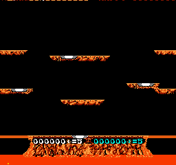

# jev-joust

Two [TypeSafe Jev](https://typesafe.ai) players, one per controller, duelling in NES Joust for score.
Requires `rom/joust.nes`.

Every decision, code runs the emulator forward over each controller state a player could hold and writes down
what actually happens. Jev reads those outcomes and picks one. Code does the arithmetic and the physics; Jev
does the judging.



Two Jev players duelling: player 1 outlasts player 2, who is knocked out having scored more, 5500 to 3000. Kills are the 500s, eggs the 250s; they reach wave 2.

## Results

On 80 recorded decisions where the options are worth different amounts, scored against what the game itself
says turns out best:

| picked by | optimal option | chose an option its own text calls fatal |
|---|---|---|
| Jev | 0.91–0.95 over four runs | 0 of 62 states offering one |
| `greedy`, same options | 0.90 | 0 |
| always the best single option | 0.725 | – |
| at random | 0.567 | – |

Eight matches, 2026-09-20, `jev-latest`, 2-player game A, up to 3600 frames. `greedy` ranks the same
simulated options by a fixed rule, so a match against it compares the judgment and nothing else.

| player 1 | player 2 | frames | winner | score | lives lost | cost |
|---|---|---|---|---|---|---|
| jev | greedy | 3576 | jev | 3500 / 1000 | 4 / 5 | $0.011 |
| greedy | jev | 3600 | neither | 9500 / 4000 | 3 / 4 | $0.011 |
| jev | rules | 2580 | jev | 8500 / 500 | 4 / 5 | $0.008 |
| rules | jev | 2400 | jev | 0 / 5500 | 5 / 2 | $0.008 |
| greedy | rules | 3600 | neither | 7500 / 3000 | 1 / 5 | $0.000 |
| rules | greedy | 3600 | neither | 2500 / 7750 | 5 / 2 | $0.000 |
| jev | jev | 2376 | jev | 3000 / 5500 | 2 / 5 | $0.014 |
| greedy | greedy | 3600 | neither | 4000 / 9500 | 3 / 3 | $0.000 |

| bot | seats | score per 1000 frames | lives lost per 1000 frames |
|---|---|---|---|
| `jev` | 6 | 1774 | 1.24 |
| `greedy` | 6 | 1819 | 0.79 |
| `rules` | 4 | 493 | 1.64 |

Jev and the fixed rule score at about the same rate, 1774 against 1819 points per 1000 frames. In the six
matches between different bots, Jev knocked its opponent out 3 times and the fixed rule 0, and Jev paid for
that with half again as many deaths. Both beat `rules`, which decides without simulated options. One match
per pairing, and player 2 outscored player 1 in both mirror matches, so the table ranks nothing on its own.

Median Jev latency 0.18 s, about 830 input tokens per call, one call per player per decision.

## Run

```bash
cp .env.example .env        # TYPESAFE_API_KEY
uv sync
uv run python joust.py --play --p1 jev --p2 greedy      # a match; bots below
uv run python joust.py --record 80                      # write labelled decisions to data/states.jsonl
uv run python joust.py --offline                        # score Jev on them; no emulator, no match
uv run --group dev pytest
```

| bot | decides by |
|---|---|
| `jev` | one Choice over the six simulated options |
| `greedy` | a fixed ranking over the same six options |
| `jev-tactic` | one Choice of `attack`, `climb` or `evade`, flown by code |
| `jev-noul` | a Choice for the stick and a Noul for the flap button |
| `rules` | fixed thresholds, flown by the same code as `jev-tactic` |
| `idle` | nothing |

A match writes `runs/<p1>-vs-<p2>-<stamp>.gif`, a `.json` with every state, option and answer, and a line in
`runs/results.jsonl`. It ends when a player is out of respawns or at `--max-frames`.

## Notes

- The six options are every combination of left, right or no direction with flapping or gliding. Each is held
  for 24 frames and then flown neutrally for 72 more; the sentence describing it covers that whole window.
- That window is what made the difference. Describing only the 24 held frames never once mentioned death,
  while 130 of 480 options died within 96 frames, so the text could not show the danger the instructions asked
  about. Widening it took optimal picks from 0.588 to 0.938 and fatal picks from 18 to 0.
- Naming the points in the option text, rather than only the geometry, tripled Jev's score across the two
  `greedy` matches, from 2500 to 7500, and cost it three more lives. Offline accuracy did not move, because
  that label settles survival first and Jev was already near the ceiling on it.
- Flap rates, measured from open air over 48 frames: no flaps falls 90 px, one per 12 frames falls 49, one per
  6 holds height, one per 4 climbs 38.
- `--record` keeps only decisions where the options are worth different amounts; on the rest every answer is
  equally good and the label would be arbitrary. That was 80 of 298.
- Eggs are read from the sprite table, where they are tile 204. Platforms are never modelled: an option that
  flies into one already reports where it ended up.
- RAM map (no published one; found with `--scan`, by matching bytes against sprite positions, and by reading
  the HUD):

| bytes | meaning |
|---|---|
| `0x54+p`, `0x58+p` | player x, y; y = 240 while dead |
| `0xE9+p` | respawns left; it drops when a rider materialises, so it does not mark a death |
| `0xEB..0xED`, `0xEE..0xF0` | score, BCD, low byte first |
| `0x720+i`, `0x72E+i`, i < 7 | enemy x, y; y = 240 is an empty slot |

- Boot: the title appears near frame 600; Select three times moves the cursor to `2 PLAYER GAME A`, then Start.
- nes-py wires only controller 0 through `step()`; `Joust.step(p1, p2)` writes controller 1's buffer before stepping.
- Snapshot/restore via nes-py's `_backup`/`_restore`, as in [jev-mario](https://github.com/4esv/jev-mario).
- Caveats: one match per pairing; player 2 outscored player 1 in both mirror matches, so seats are not equal;
  the recorded states come from `greedy`'s play and inherit its habits; wave 1 only.
